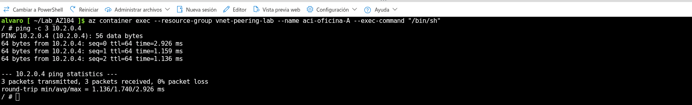
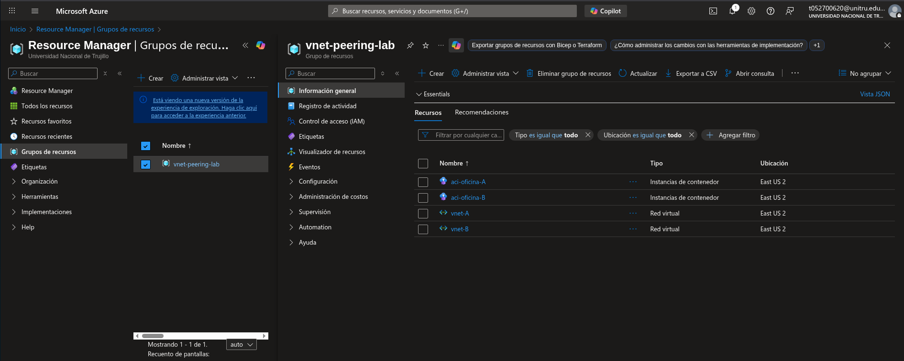

# ☁️ Azure VNet Peering Lab (IaC)


Este proyecto demuestra la implementación de una arquitectura de red segura en Azure utilizando **Infrastructure as Code (Bicep)**. El objetivo es simular la conectividad privada entre dos oficinas virtuales aisladas mediante **VNet Peering**, validando la comunicación a través de instancias de contenedor efímeras.

Este laboratorio forma parte de mi preparación práctica para la certificación **AZ-104: Microsoft Azure Administrator**.

## 📐 Arquitectura

El despliegue automatizado crea el siguiente entorno:

### Componentes desplegados:
1.  **VNet A (Oficina A):** `10.1.0.0/16` con subred delegada para contenedores.
2.  **VNet B (Oficina B):** `10.2.0.0/16` con subred delegada para contenedores.
3.  **Global VNet Peering:** Conexión bidireccional de baja latencia entre ambas redes.
4.  **Azure Container Instances (ACI):** Dos contenedores Linux (Alpine) desplegados dentro de las redes virtuales para realizar pruebas de conectividad (ICMP/Ping).
   


## 🚀 Despliegue 

### Pasos
1.  **Clonar el repositorio:**
    ```bash
    git clone https://github.com/Epx1lon/Lab_AZ104
    cd Lab_AZ104
    ```

2.  **Crear el grupo de recursos:**
    ```bash
    az group create --name vnet-peering-lab --location eastus2
    ```

3.  **Desplegar la infraestructura:**
    ```bash
    az deployment group create --resource-group vnet-peering-lab --template-file codigo/main.bicep
    ```

## 🧪 Validación y pruebas

Una vez finalizado el despliegue, obtendrás las IPs privadas de cada contenedor en los `outputs` de la terminal.

> Para validar el **VNet Peering**, accedemos a la consola del contenedor A y hacemos ping al contenedor B:



> Recursos creados desde el archivo main.bicep.




